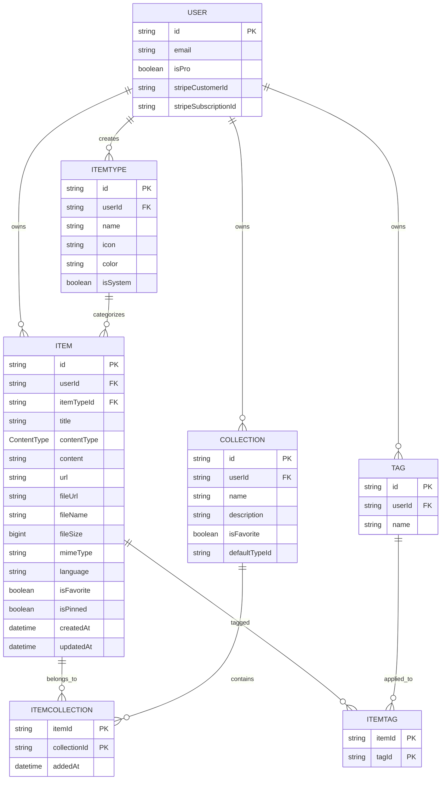
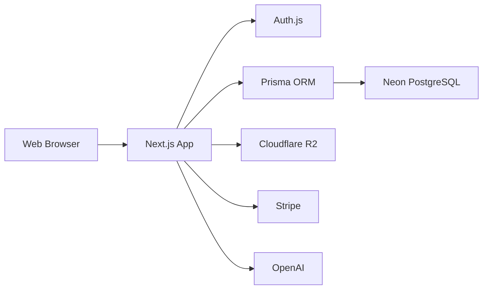
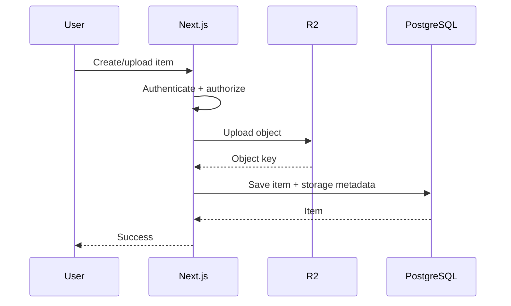
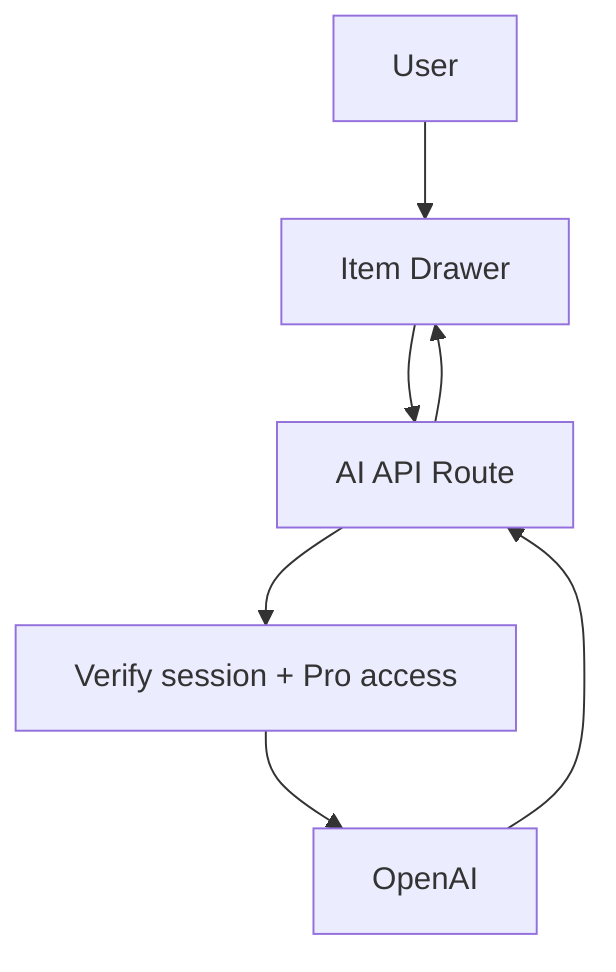

# DevStash — Project Overview

> **DevStash** is a fast, searchable, AI-enhanced knowledge hub for developers: one place for snippets, prompts, commands, notes, links, files, images, and reusable development context.

**Status:** Foundation / MVP planning  
**Primary audience:** Developers, AI-first developers, educators/content creators, full-stack builders

---

## 1. Product Vision

Developers keep valuable knowledge scattered across:

- VS Code and IDE snippets
- Notion and other note apps
- AI chat histories
- Project context files
- Browser bookmarks
- Random documents/folders
- `.txt` files and shell history
- GitHub gists and project templates

That fragmentation creates **context switching, lost knowledge, and inconsistent workflows**.

DevStash turns those fragments into a single, structured, searchable workspace.

### Product principles

1. **Fast first** — saving and retrieving an item should feel nearly instant.
2. **Developer-native** — keyboard-friendly, syntax-aware, dark-mode friendly.
3. **Flexible** — one item can live in multiple collections and have multiple tags.
4. **Progressively powerful** — MVP stays simple; AI and automation build on the same data model.
5. **Portable** — users own their data and can export it.

---

## 2. Target Users

| Persona | Primary need |
|---|---|
| 👨‍💻 **Everyday Developer** | Quickly grab snippets, prompts, commands, and links |
| 🤖 **AI-first Developer** | Save prompts, context, workflows, and system messages |
| 🎓 **Content Creator / Educator** | Organize code blocks, explanations, and course notes |
| 🧑‍💻 **Full-stack Builder** | Collect patterns, boilerplates, API examples, and references |

---

## 3. Core Information Architecture

The core hierarchy should remain intentionally simple:

```text
User
 ├── Item Types
 │    ├── System types
 │    └── Custom types (future / Pro)
 │
 ├── Items
 │    ├── Tags
 │    └── Collections
 │
 └── Collections
      └── Items
```

An item **does not belong to only one collection**. The many-to-many relationship is intentional.

Example:

```text
React useDebounce snippet
       │
       ├── React Patterns
       ├── Interview Prep
       └── Performance
```

---

# 4. Item Model

An **Item** is the central entity in DevStash.

### System item types

These are immutable system types for the initial release:

| Type | Storage | Icon | Color |
|---|---|---|---|
| Snippet | Text | `Code` | `#3b82f6` |
| Prompt | Text | `Sparkles` | `#8b5cf6` |
| Command | Text | `Terminal` | `#f97316` |
| Note | Text | `StickyNote` | `#fde047` |
| File | File | `File` | `#6b7280` |
| Image | File | `Image` | `#ec4899` |
| Link | URL | `Link` | `#10b981` |

> **Recommendation:** Keep `itemType` normalized rather than using a hard-coded enum. This lets the system support custom types later without a migration that changes the fundamental item architecture.

### Item storage rules

Text-based types:

```text
contentType = TEXT
content     = Markdown/text
fileUrl     = null
```

File/image types:

```text
contentType = FILE
content     = null
fileUrl     = R2 object URL/key
fileName    = original filename
fileSize    = bytes
```

Link type:

```text
contentType = URL
url         = destination
```

---

# 5. Collections

Collections are flexible containers for organizing items.

Examples:

- ⚛️ React Patterns
- 🧠 Prototype Prompts
- 📁 Context Files
- 🐍 Python Snippets
- 🎯 Interview Prep
- 🚀 Production Checklist

### Rules

- A user can create unlimited collections on Pro.
- Free users are limited to 3 collections.
- An item can belong to many collections.
- Collections can contain any item type.
- `defaultTypeId` can optionally suggest a type when adding a new item from a collection.
- Collection membership is represented by an explicit join table so metadata such as `addedAt` can be tracked.

---

# 6. Tags

Tags provide lightweight cross-cutting organization.

Example:

```text
Item: "React useDebounce Hook"

Tags:
#react
#hooks
#performance
#typescript
```

Tags should be **unique per user**, not globally unique.

Recommended future capabilities:

- Tag autocomplete
- Tag filtering
- AI-generated tag suggestions
- Tag management / rename
- Tag usage counts

---

# 7. Search

Search is a core product feature, not an afterthought.

### MVP search targets

Search across:

- Item title
- Item content
- Description
- URL
- Tags
- Item type
- Collection

### Suggested UX

```text
⌘ K / Ctrl K

┌─────────────────────────────────────────────┐
│ 🔍 Search snippets, prompts, commands...    │
├─────────────────────────────────────────────┤
│ Snippets                                    │
│   useDebounce Hook                    React │
│                                             │
│ Prompts                                     │
│   Review this PR for security issues  AI    │
└─────────────────────────────────────────────┘
```

### Search implementation

**MVP:** PostgreSQL search.

Avoid adding Redis solely for search.

A sensible progression:

1. PostgreSQL indexes / full-text search
2. PostgreSQL `pg_trgm` if fuzzy matching is needed
3. Dedicated search infrastructure only when scale justifies it

This keeps the first architecture simpler and cheaper.

---

# 8. Authentication

Supported authentication:

- Email/password
- GitHub OAuth

Use **Auth.js / NextAuth** with the application's user model.

User account fields:

- `id`
- `email`
- `name`
- `image`
- `isPro`
- Stripe customer ID
- Stripe subscription ID
- timestamps

> **Security rule:** Every application query involving user-owned data must be scoped to the authenticated user's ID. Never trust a client-supplied `userId`.

---

# 9. Proposed Prisma Schema

The following is a cleaned-up starting point rather than a final immutable schema.

```prisma
enum ContentType {
  TEXT
  URL
  FILE
}

model User {
  id                   String   @id @default(cuid())
  name                 String?
  email                String?  @unique
  emailVerified        DateTime?
  image                String?

  isPro                Boolean  @default(false)
  stripeCustomerId     String?  @unique
  stripeSubscriptionId String?  @unique

  items                Item[]
  collections          Collection[]
  itemTypes            ItemType[]
  tags                 Tag[]

  createdAt            DateTime @default(now())
  updatedAt            DateTime @updatedAt

  // Auth.js relations may be added here depending on adapter.
}

model ItemType {
  id        String   @id @default(cuid())
  name      String
  icon      String
  color     String
  isSystem  Boolean  @default(false)

  userId    String?
  user      User?    @relation(fields: [userId], references: [id], onDelete: Cascade)

  items     Item[]

  createdAt DateTime @default(now())
  updatedAt DateTime @updatedAt

  @@unique([userId, name])
  @@index([userId])
}

model Item {
  id          String      @id @default(cuid())
  title       String
  contentType ContentType

  content     String?     @db.Text
  description String?     @db.Text

  url         String?

  fileUrl     String?
  fileName    String?
  fileSize    BigInt?
  mimeType    String?

  language    String?

  isFavorite  Boolean     @default(false)
  isPinned    Boolean     @default(false)

  userId      String
  user        User        @relation(fields: [userId], references: [id], onDelete: Cascade)

  itemTypeId  String
  itemType    ItemType    @relation(fields: [itemTypeId], references: [id], onDelete: Restrict)

  collections ItemCollection[]
  tags        ItemTag[]

  createdAt   DateTime    @default(now())
  updatedAt   DateTime    @updatedAt

  @@index([userId, createdAt])
  @@index([userId, isPinned])
  @@index([userId, isFavorite])
  @@index([userId, itemTypeId])
}

model Collection {
  id            String           @id @default(cuid())
  name          String
  description   String?          @db.Text
  isFavorite    Boolean          @default(false)

  defaultTypeId String?
  userId        String

  user          User             @relation(fields: [userId], references: [id], onDelete: Cascade)
  items         ItemCollection[]

  createdAt     DateTime         @default(now())
  updatedAt     DateTime         @updatedAt

  @@index([userId, createdAt])
  @@index([userId, isFavorite])
}

model ItemCollection {
  itemId       String
  collectionId String
  addedAt      DateTime @default(now())

  item         Item       @relation(fields: [itemId], references: [id], onDelete: Cascade)
  collection   Collection @relation(fields: [collectionId], references: [id], onDelete: Cascade)

  @@id([itemId, collectionId])
  @@index([collectionId, addedAt])
}

model Tag {
  id        String    @id @default(cuid())
  name      String

  userId    String
  user      User      @relation(fields: [userId], references: [id], onDelete: Cascade)

  items     ItemTag[]

  createdAt DateTime  @default(now())

  @@unique([userId, name])
  @@index([userId])
}

model ItemTag {
  itemId String
  tagId  String

  item   Item @relation(fields: [itemId], references: [id], onDelete: Cascade)
  tag    Tag  @relation(fields: [tagId], references: [id], onDelete: Cascade)

  @@id([itemId, tagId])
  @@index([tagId])
}
```

## Schema notes

### 1. Prefer `mimeType` over only `contentType`

`contentType` answers **how DevStash stores the item**.

`mimeType` answers **what the uploaded file actually is**.

For example:

```text
contentType = FILE
mimeType    = application/pdf
```

This becomes useful for previews, validation, downloads, and future processing.

### 2. Store an R2 object key where practical

Instead of depending entirely on a permanent public URL:

```text
fileUrl = "https://..."
```

consider storing:

```text
storageKey = "users/{userId}/items/{itemId}/..."
```

and generating signed URLs when files need to be accessed.

This gives better control over private files and makes storage-provider changes easier.

### 3. Keep ownership explicit

`Item`, `Collection`, `Tag`, and custom `ItemType` all have explicit ownership through `userId`.

This makes authorization and query scoping much safer.

---

# 10. Entity Relationship Diagram



---

# 11. Application Architecture



### Architectural direction

Keep the application as a **single Next.js repository** initially.

```text
DevStash
│
├── Web UI
├── Server actions / API routes
├── Auth
├── Database access
├── File upload handling
├── AI integrations
└── Billing
```

Avoid prematurely splitting into separate frontend/backend services.

---

# 12. Recommended Stack

| Layer | Technology |
|---|---|
| Framework | Next.js 16 |
| UI | React 19 |
| Language | TypeScript |
| Styling | Tailwind CSS v4 |
| Components | shadcn/ui |
| Database | Neon PostgreSQL |
| ORM | Prisma 7 |
| Authentication | Auth.js / NextAuth |
| File storage | Cloudflare R2 |
| Payments | Stripe |
| AI | OpenAI |
| Search | PostgreSQL initially |
| Cache | Redis — optional, later |

### Official documentation

- [Next.js](https://nextjs.org/docs)
- [React](https://react.dev/)
- [TypeScript](https://www.typescriptlang.org/docs/)
- [Tailwind CSS](https://tailwindcss.com/docs)
- [shadcn/ui](https://ui.shadcn.com/)
- [Prisma](https://www.prisma.io/docs)
- [Neon](https://neon.com/docs)
- [Auth.js](https://authjs.dev/)
- [Cloudflare R2](https://developers.cloudflare.com/r2/)
- [Stripe](https://docs.stripe.com/)
- [OpenAI API](https://platform.openai.com/docs/)

---

# 13. Database Migration Policy

**Never use `prisma db push` for the application's real schema workflow.**

All structural database changes should go through migrations.

Recommended workflow:

```text
Change Prisma schema
       │
       ▼
prisma migrate dev
       │
       ▼
Review generated SQL
       │
       ▼
Test locally
       │
       ▼
Commit migration
       │
       ▼
Deploy
       │
       ▼
prisma migrate deploy
```

Production should only run committed migrations.

> Treat migrations as version-controlled application code.

---

# 14. File Storage

Use **Cloudflare R2** for Pro file/image uploads.

Suggested object layout:

```text
users/
  {userId}/
    items/
      {itemId}/
        original
```

Potential metadata:

```text
storageKey
mimeType
fileName
fileSize
```

### Upload flow



For larger uploads, prefer presigned/direct-to-R2 uploads rather than routing the entire file through the application server.

---

# 15. AI Features — Pro

Initial AI capabilities:

- 🏷️ AI auto-tag suggestions
- 📝 AI summaries
- 💡 Explain this code
- ✨ Prompt optimizer

### Suggested architecture



AI requests should be server-side.

**Do not expose the OpenAI API key to the browser.**

### AI feature principles

- Make AI actions explicit rather than silently modifying user content.
- Show generated suggestions before destructive changes.
- Keep prompts/context scoped to the current user and item.
- Add rate limits and usage limits before public launch.
- Log safe operational metadata, not unnecessary private content.

---

# 16. Billing & Monetization

## Free

- **50 items**
- **3 collections**
- All system types except File/Image
- Basic search
- No file/image uploads
- No AI features

## Pro

**$8/month** or **$72/year**

- Unlimited items
- Unlimited collections
- File uploads
- Image uploads
- Custom types
- AI auto-tagging
- AI code explanation
- AI prompt optimizer
- Export data as JSON/ZIP
- Priority support

### Important development rule

During development:

```text
Feature gates exist
        │
        ▼
But billing restrictions are bypassed for development/test users
```

Build entitlement checks early so Pro functionality does not need to be retrofitted later.

Recommended conceptual helper:

```ts
canAccess(user, "ai")
canAccess(user, "file_upload")
canAccess(user, "export")
canAccess(user, "custom_types")
```

Avoid scattering checks such as:

```ts
if (user.isPro) { ... }
```

throughout the codebase.

---

# 17. Stripe Data Model Direction

For the MVP, Stripe IDs on `User` are sufficient:

```text
User
 ├── stripeCustomerId
 ├── stripeSubscriptionId
 └── isPro
```

As billing becomes more sophisticated, consider a dedicated subscription table for:

- subscription status
- price/product IDs
- current period
- cancellation state
- billing events
- multiple plans

Stripe webhooks should be the source of truth for subscription state rather than trusting client-side checkout success.

---

# 18. UI / UX

## Design direction

DevStash should feel:

- Modern
- Minimal
- Developer-focused
- Fast
- Dense without feeling cramped
- Keyboard-friendly

References:

- Notion
- Linear
- Raycast

### Theme

- Dark mode by default
- Light mode available
- Subtle borders
- Restrained shadows
- Generous whitespace
- Strong typography hierarchy
- Syntax highlighting for code

---

# 19. Main Layout

```text
┌─────────────────────────────────────────────────────────────┐
│ DevStash                                      ⌘K   Avatar   │
├───────────────┬─────────────────────────────────────────────┤
│               │                                             │
│  + New Item   │   Collections                              │
│               │                                             │
│  TYPES        │   ┌────────────┐ ┌────────────┐            │
│  > Snippets   │   │ React      │ │ Prompts    │            │
│  > Prompts    │   │ Patterns   │ │            │            │
│  > Notes      │   └────────────┘ └────────────┘            │
│  > Commands   │                                             │
│  > Files      │   Recent Items                              │
│  > Images     │   ┌────────────┐ ┌────────────┐            │
│  > Links      │   │ useMemo    │ │ PR Prompt  │            │
│               │   └────────────┘ └────────────┘            │
│  COLLECTIONS  │                                             │
│  React        │                                             │
│  AI Prompts   │                                             │
│  Context      │                                             │
│               │                                             │
└───────────────┴─────────────────────────────────────────────┘
```

### Sidebar

- New Item
- Item types
- Favorite collections
- Recent collections
- Settings
- Billing / upgrade

On mobile, the sidebar becomes a drawer.

---

# 20. Item Drawer

Items should open in a quick-access drawer rather than forcing full-page navigation for common workflows.

```text
┌─────────────────────────────────────────────┐
│ Snippet                         ☆   ⋮   ×    │
│                                             │
│ useDebounce                                 │
│                                             │
│ #react #hooks #typescript                   │
│                                             │
│ ┌─────────────────────────────────────────┐ │
│ │ export function useDebounce(...)        │ │
│ │                                         │ │
│ │ ...                                     │ │
│ └─────────────────────────────────────────┘ │
│                                             │
│ Collections                                │
│ [React Patterns] [Interview Prep]           │
│                                             │
│ Created Sep 4 · Updated Sep 4               │
└─────────────────────────────────────────────┘
```

Drawer actions:

- Edit
- Duplicate
- Favorite
- Pin
- Add/remove collections
- Manage tags
- Copy content
- Open URL
- Download file
- AI actions
- Delete

---

# 21. Item Creation

Creation should be optimized for speed.

Possible flow:

```text
+ New Item
     │
     ▼
Choose type
     │
     ├── Snippet
     ├── Prompt
     ├── Note
     ├── Command
     ├── File
     ├── Image
     └── Link
     │
     ▼
Quick editor drawer
     │
     ├── Title
     ├── Content / URL / File
     ├── Tags
     ├── Collections
     └── Save
```

Potential future shortcut:

```text
⌘ K → "Save item"
```

---

# 22. Collection Visual Design

Collections can use the colors of their most common item types.

For example:

```text
React Patterns
████████████████████
blue accent because snippets dominate
```

But avoid making entire cards heavily saturated. Prefer:

- tinted background
- subtle type-colored border
- small type indicators
- accessible text contrast

The color should communicate hierarchy, not become decoration that reduces readability.

---

# 23. Micro-interactions

Use restrained motion:

- Card hover states
- Drawer transitions
- Toast notifications
- Loading skeletons
- Copy confirmation
- Save confirmation
- Optimistic favorite/pin toggles
- Drag/drop feedback where useful

Avoid excessive animation. DevStash is a productivity tool; speed and clarity should win over visual spectacle.

---

# 24. Responsive Strategy

Desktop-first, but mobile usable.

### Desktop

```text
Sidebar + content + drawers
```

### Tablet

```text
Collapsible sidebar + content
```

### Mobile

```text
Top bar
   ↓
Content
   ↓
Bottom/new-item action

Sidebar → navigation drawer
Item drawer → full-screen sheet
```

The primary workflows that must work well on mobile:

1. Search
2. Open item
3. Copy item
4. Create item
5. Favorite/pin
6. Browse collections

---

# 25. MVP Scope

The MVP should focus on the core value proposition rather than launching every planned feature.

## Phase 1 — Foundation

- Next.js application
- Auth.js
- Neon + Prisma
- User model
- System item types
- Database migrations
- Authorization helpers
- Basic layout/theme

## Phase 2 — Core Knowledge Management

- Create item
- Edit item
- Delete item
- Favorite
- Pin
- Tags
- Collections
- Many-to-many collection membership
- Markdown editor
- Syntax highlighting
- Item drawer

## Phase 3 — Search & Retrieval

- Search
- Type filters
- Tag filters
- Collection filters
- Recent items
- Favorites
- Keyboard shortcut / command menu

## Phase 4 — Pro Foundation

- Stripe
- Entitlement system
- R2
- File/image uploads
- Export
- AI API abstraction

## Phase 5 — AI

- Auto-tag suggestions
- Summaries
- Code explanation
- Prompt optimizer

---

# 26. Explicitly Defer

To keep the initial release focused, avoid building these too early:

- Redis caching
- Dedicated search engine
- Real-time collaboration
- Team workspaces
- Browser extension
- VS Code extension
- CLI
- Mobile app
- Complex AI agents
- Advanced analytics
- Social sharing
- Public item marketplace

These are potentially valuable, but they should follow evidence of product-market fit.

---

# 27. Suggested API / Server Boundaries

Even inside a single Next.js repo, keep domain operations organized.

Example:

```text
src/
├── app/
│   ├── (auth)/
│   ├── (dashboard)/
│   └── api/
│
├── components/
│   ├── items/
│   ├── collections/
│   ├── search/
│   └── ui/
│
├── lib/
│   ├── auth/
│   ├── db/
│   ├── billing/
│   ├── storage/
│   ├── ai/
│   └── permissions/
│
├── actions/
│   ├── items.ts
│   ├── collections.ts
│   ├── tags.ts
│   └── uploads.ts
│
└── prisma/
    ├── schema.prisma
    └── migrations/
```

Prefer server actions for straightforward authenticated mutations where appropriate, and API routes/route handlers for integrations such as:

- Stripe webhooks
- R2 upload endpoints
- AI requests where an HTTP endpoint is useful
- External integrations

---

# 28. Authorization Model

Every user-owned resource follows:

```text
Request
  │
  ▼
Authenticate
  │
  ▼
Identify current user
  │
  ▼
Load resource WHERE id = X AND userId = currentUser.id
  │
  ▼
Authorize feature entitlement
  │
  ▼
Perform operation
```

Do **not** rely on:

```text
client says item.userId = currentUser.id
```

The server must enforce ownership.

---

# 29. Important Product Decisions

### Item types vs enums

Use a database-backed `ItemType` model because custom types are planned.

### Collections vs folders

Collections are **many-to-many**, unlike traditional folders.

### Tags

Tags are user-scoped and many-to-many.

### Files

Files belong to items and should be stored in R2, not PostgreSQL.

### Search

Start with PostgreSQL; introduce specialized infrastructure only when required.

### Redis

Do not introduce Redis until there is a demonstrated caching/rate-limit/background-job requirement.

### AI

Put AI behind a server-side service boundary so models can change later without rewriting the UI.

---

# 30. Potential Future Extensions

The data model should leave room for:

### Developer integrations

```text
VS Code extension
       │
       ▼
    DevStash API
       │
       ├── Save snippet
       ├── Search stash
       └── Insert item
```

### CLI

```bash
devstash save
devstash search react
devstash get <item>
devstash copy <item>
```

### Browser extension

Save:

- Documentation links
- Stack Overflow references
- GitHub repositories
- Articles
- Code selections

### Team workspaces

Potential future hierarchy:

```text
User
 └── Workspace
      ├── Members
      ├── Collections
      ├── Items
      └── Permissions
```

This is a reason to avoid baking assumptions about teams into the initial single-user UI, while still keeping ownership boundaries clean.

---

# 31. Risks & Mitigations

| Risk | Mitigation |
|---|---|
| Search becomes slow | PostgreSQL indexes + full-text/trigram search |
| File storage becomes expensive | R2 + quotas + lifecycle policies |
| AI costs grow | Pro-only access + rate limits + usage tracking |
| Authorization bugs | Centralized ownership/permission helpers |
| Schema becomes difficult to evolve | Prisma migrations only |
| Too much MVP scope | Prioritize save → organize → find → use |
| UI becomes cluttered | Keep item drawer and collections simple |
| Vendor lock-in | Abstract storage, AI, and billing integrations |

---

# 32. Definition of a Successful MVP

A developer should be able to:

1. Sign in.
2. Create a snippet in seconds.
3. Add tags and collections.
4. Create another item of a different type.
5. Put the same item in multiple collections.
6. Search and find the item quickly.
7. Open it in a drawer.
8. Copy/use it immediately.
9. Favorite or pin it.
10. Return later and understand why they saved it.

If those workflows feel **faster than the scattered tools DevStash replaces**, the MVP is doing its job.

---

# 33. North-Star Workflow

```text
CAPTURE
   │
   ▼
ORGANIZE
   │
   ├── Collections
   └── Tags
   │
   ▼
FIND
   │
   ├── Search
   ├── Filters
   └── Recent
   │
   ▼
USE
   │
   ├── Copy
   ├── Open
   ├── Download
   └── Apply
   │
   ▼
ENHANCE
   │
   └── AI
```

**The product loop is:**

> **Capture → Organize → Find → Use → Enhance**

Everything in the MVP should reinforce this loop.
