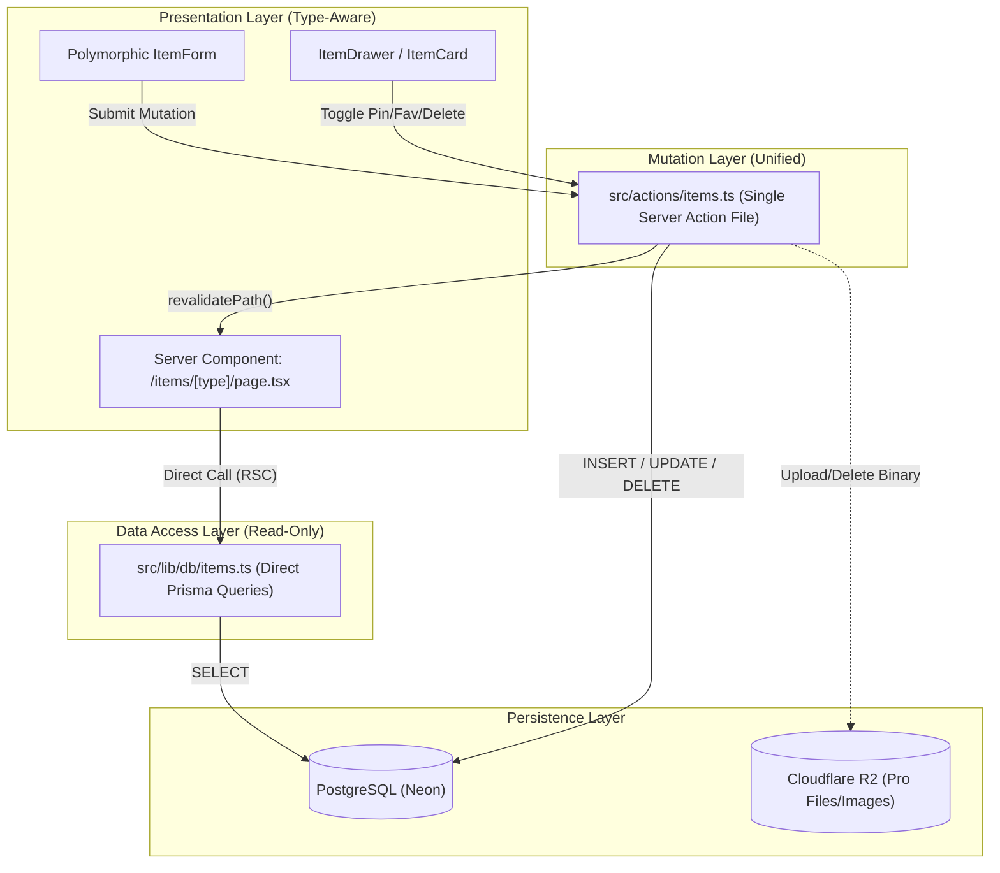
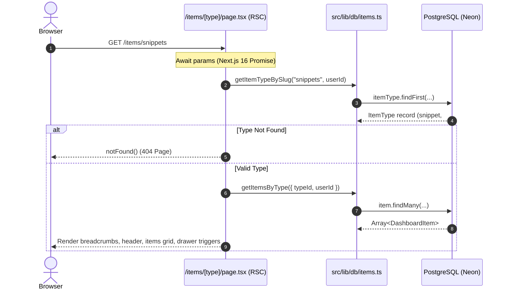
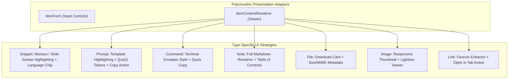

# DevStash Item CRUD Architecture Specification

> **Architectural Specification & System Design**  
> A unified, polymorphic CRUD architecture supporting all 7 system item types (`snippet`, `prompt`, `command`, `note`, `file`, `image`, `link`) across Next.js 16 (App Router), React 19 Server/Client Components, Prisma 7, and PostgreSQL.

---

## 1. Architectural Principles & Overview

DevStash treats all 7 content types as variants of a single core entity: `Item`. Instead of maintaining separate pipelines, redundant database tables, or divergent server actions for each type, the architecture enforces a **unified polymorphic CRUD engine**:



### Core Tenets

1. **Unified Mutations in One Action File:** All creates, updates, deletes, and status toggles reside in `src/actions/items.ts`. Mutation actions validate storage invariants by `ContentType` (`TEXT`, `FILE`, `URL`), authenticate sessions, and perform atomic relation updates in PostgreSQL transactions.
2. **Direct Server Component Queries via `src/lib/db`:** Read operations never go through Server Actions or HTTP API routes. Server Components call strongly typed functions in `src/lib/db/items.ts` directly via the Prisma client.
3. **Single Dynamic Route (`/items/[type]`):** A single parameterized page handles all item types, normalizing slugs, validating against system and custom item types, and rendering adaptive presentation layouts.
4. **Type-Specific Logic Lives in Components, NOT Actions:** The server actions do not contain branching business logic like `if (type === 'snippet')`. Type-specific behaviors (syntax highlighting, markdown parsing, terminal formatting, file dropzones, URL linkouts) are strictly encapsulated in client/server presentation components via polymorphic adapters.

---

## 2. File Organization & Responsibilities

The CRUD subsystem adheres strictly to project conventions:

```text
src/
├── actions/
│   └── items.ts                     # Single entrypoint for all item mutations
├── lib/
│   ├── db/
│   │   ├── items.ts                 # Database queries called directly by Server Components
│   │   └── collections.ts           # Collection queries & default user resolution
│   └── validations/
│       └── item.ts                  # Zod / TypeScript schema definitions for item CRUD
├── types/
│   └── items.ts                     # Shared interfaces, ActionResults, and DTOs
├── app/
│   └── (app)/
│       ├── dashboard/
│       │   └── page.tsx             # Dashboard displaying pinned/recent items
│       └── items/
│           └── [type]/
│               └── page.tsx         # Unified dynamic route for all item types
└── components/
    ├── dashboard/
    │   ├── item-card.tsx            # Compact item card with dynamic left accent border
    │   ├── pinned-items.tsx         # Pinned items grid section
    │   └── recent-items.tsx         # Recent items list section
    └── items/
        ├── item-content-renderer.tsx # Polymorphic content viewer (code, md, file, link)
        ├── item-drawer.tsx          # Slide-over quick view detail drawer
        ├── item-dialog.tsx          # Modal container for Create & Edit workflows
        ├── item-form.tsx            # Adaptive form with conditional fields per ContentType
        ├── item-actions-menu.tsx    # Dropdown menu (Edit, Copy, Pin, Favorite, Delete)
        └── item-delete-dialog.tsx   # Confirm delete modal dialog
```

### Component Responsibility Matrix

| Component | Responsibility | Server / Client |
|:---|:---|:---:|
| `src/app/(app)/items/[type]/page.tsx` | Resolves type route param, fetches items from `src/lib/db/items.ts`, renders breadcrumbs & type header | **Server** |
| `src/components/dashboard/item-card.tsx` | Displays item summary, type icon, left accent border, tags, star/pin status | **Client/Server** |
| `src/components/items/item-drawer.tsx` | Slide-over inspector showing full content, timestamps, collections, and action triggers | **Client** |
| `src/components/items/item-dialog.tsx` | Modal dialog wrapper for Create/Edit item workflows | **Client** |
| `src/components/items/item-form.tsx` | Dynamic form switching input fields based on selected `ItemType` / `ContentType` | **Client** |
| `src/components/items/item-content-renderer.tsx` | Strategy-based viewer: syntax highlighter, markdown parser, shell viewer, file preview | **Client** |
| `src/components/items/item-actions-menu.tsx` | Contextual action triggers (Copy, Toggle Pin, Toggle Favorite, Edit, Delete) | **Client** |
| `src/components/items/item-delete-dialog.tsx` | Modal confirmation for soft or hard item deletion | **Client** |

---

## 3. Dynamic Routing: `/items/[type]`

The route `src/app/(app)/items/[type]/page.tsx` serves as the centralized view for all item types.



### 1. Next.js 16 Promise Params Handling
In Next.js 16, route parameters are asynchronous Promises. The page resolves `params` before executing database queries:

```typescript
interface ItemTypePageProps {
  params: Promise<{ type: string }>;
}

export default async function ItemTypePage({ params }: ItemTypePageProps) {
  const { type } = await params;
  // ...
}
```

### 2. Slug Normalization & Resolution
Users may navigate using singular or plural slugs (e.g., `/items/snippet`, `/items/snippets`, `/items/prompts`). The router normalizes input:
- Lowercase input: `type.toLowerCase()`.
- Strips trailing `s` for lookup: `type.replace(/s$/, "")`.
- Matches against system names (`snippet`, `prompt`, `command`, `note`, `file`, `image`, `link`) or custom user-created `ItemType` records.
- If no match is found, invokes Next.js `notFound()`.

### 3. Dynamic Page Metadata
The route exports `generateMetadata` to set the browser title dynamically:

```typescript
export async function generateMetadata({ params }: ItemTypePageProps): Promise<Metadata> {
  const { type } = await params;
  const itemType = await resolveItemType(type);
  if (!itemType) return { title: "Not Found — DevStash" };
  return {
    title: `${itemType.displayName} — DevStash`,
    description: `Manage your ${itemType.displayName.toLowerCase()} in DevStash.`,
  };
}
```

---

## 4. Unified Server Actions (`src/actions/items.ts`)

All database mutations reside in `src/actions/items.ts`. Each action follows a strict lifecycle:
1. **Authentication:** Verifies session via `await auth()`. Returns error if unauthenticated.
2. **Tenant Isolation:** Enforces `userId: session.user.id` on all Prisma operations.
3. **Input Validation:** Validates payload against TypeScript/Zod schemas, checking required fields based on `ContentType`.
4. **Entitlement Verification:** Verifies Pro status (`user.isPro`) if `contentType === "FILE"`.
5. **Relational Consistency:** Manages Many-to-Many `ItemCollection` and `ItemTag` associations atomically inside a `prisma.$transaction`.
6. **Cache Invalidation:** Calls `revalidatePath()` to refresh affected Server Components.
7. **Consistent Output:** Returns structured `ActionResult<T>`.

### Key Mutation Signatures

```typescript
// Shared Result Type
export interface ActionResult<T = unknown> {
  success: boolean;
  data?: T;
  error?: string;
  message?: string;
}

// 1. Create Item Action
export async function createItemAction(
  input: CreateItemInput
): Promise<ActionResult<DashboardItem>>;

// 2. Update Item Action
export async function updateItemAction(
  id: string,
  input: UpdateItemInput
): Promise<ActionResult<DashboardItem>>;

// 3. Delete Item Action
export async function deleteItemAction(
  id: string
): Promise<ActionResult<{ id: string }>>;

// 4. Toggle Pin Action (Optimistic-ready)
export async function togglePinItemAction(
  id: string
): Promise<ActionResult<{ id: string; isPinned: boolean }>>;

// 5. Toggle Favorite Action (Optimistic-ready)
export async function toggleFavoriteItemAction(
  id: string
): Promise<ActionResult<{ id: string; isFavorite: boolean }>>;
```

### Relational Transaction Strategy (Tags & Collections)

When an item is created or updated, tags and collections are synchronized atomically:

```typescript
await prisma.$transaction(async (tx) => {
  // 1. Upsert user-scoped tags
  const tagIds: string[] = [];
  for (const tagName of input.tags) {
    const tag = await tx.tag.upsert({
      where: { userId_name: { userId, name: tagName } },
      update: {},
      create: { userId, name: tagName },
    });
    tagIds.push(tag.id);
  }

  // 2. Create or Update Item
  const item = await tx.item.create({
    data: {
      title: input.title,
      description: input.description,
      contentType: input.contentType,
      content: input.content,
      url: input.url,
      language: input.language,
      fileUrl: input.fileUrl,
      fileName: input.fileName,
      fileSize: input.fileSize,
      mimeType: input.mimeType,
      storageKey: input.storageKey,
      isPinned: input.isPinned ?? false,
      isFavorite: input.isFavorite ?? false,
      userId,
      itemTypeId: input.itemTypeId,
      // Junction associations
      tags: {
        create: tagIds.map((tagId) => ({ tagId })),
      },
      collections: {
        create: (input.collectionIds ?? []).map((collectionId) => ({ collectionId })),
      },
    },
  });

  return item;
});
```

### Cache Revalidation Standard
After successful mutation, the action invalidates:
- `revalidatePath("/dashboard")` (updates overview stats, pinned items, recent items).
- `revalidatePath("/items/[type]", "page")` (updates the specific type list).
- `revalidatePath("/", "layout")` (updates sidebar live counts).

---

## 5. Direct Data Fetching (`src/lib/db/items.ts`)

Read queries are executed directly within Server Components without HTTP overhead:

### Function Specifications

```typescript
/**
 * Fetches items belonging to a specific item type.
 * Scoped strictly to the session user.
 */
export async function getItemsByType(options: {
  typeName: string;
  userId?: string;
  limit?: number;
  offset?: number;
  collectionId?: string;
  tag?: string;
}): Promise<DashboardItem[]>;

/**
 * Fetches a single item by ID with tags and collections included.
 * Returns null if the item doesn't exist or doesn't belong to the user.
 */
export async function getItemById(
  id: string,
  userId?: string
): Promise<DashboardItemDetail | null>;

/**
 * Fetches pinned items for the dashboard.
 */
export async function getPinnedItems(
  userId?: string,
  limit?: number
): Promise<DashboardItem[]>;

/**
 * Fetches recent items for the dashboard.
 */
export async function getRecentItems(
  userId?: string,
  limit?: number
): Promise<DashboardItem[]>;

/**
 * Fetches system item types with live item counts for the sidebar navigation.
 * Memoized per server request using React cache().
 */
export const getSidebarItemTypes = cache(
  async (userId?: string): Promise<SidebarItemType[]> => { ... }
);

/**
 * Fetches aggregated statistics (totalItems, favoriteItems).
 */
export async function getItemStats(userId?: string): Promise<ItemStats>;
```

---

## 6. Polymorphic UI: Where Type Logic Lives

Type-specific logic lives entirely inside presentation components. The database and actions deal strictly with `contentType` and generic metadata; the components adapt rendering to each type's unique requirements.



### 1. Form Adaptation (`src/components/items/item-form.tsx`)

The form renders common inputs at the top and switches its body based on the selected `ItemType`:

- **Universal Fields:** Title, Description, Collection multi-select, Tag input chip group, Star & Pin toggles.
- **Dynamic Field Sections:**
  - **Snippet:** Monospace code textarea, programming language selector (TypeScript, Python, Go, Rust, SQL, Dockerfile, etc.).
  - **Prompt:** Markdown prompt template textarea with variable helper pill insertions.
  - **Command:** Monospace terminal input field, shell selector (`bash`, `zsh`, `sh`, `powershell`).
  - **Note:** Full markdown editor with "Write" and "Preview" tabs.
  - **File:** File upload dropzone with progress bar, accepted extension guide, file size limit check.
  - **Image:** Drag-and-drop image dropzone with instantaneous preview and aspect-ratio indicators.
  - **Link:** Destination URL field with live URL validation and optional preview generator.

### 2. Content Renderer (`src/components/items/item-content-renderer.tsx`)

The content viewer uses a strategy pattern to render the item body cleanly:

```typescript
interface ItemContentRendererProps {
  item: DashboardItem;
  variant?: "preview" | "full";
}

export function ItemContentRenderer({ item, variant = "full" }: ItemContentRendererProps) {
  switch (item.type.toLowerCase()) {
    case "snippet":
      return <CodeSnippetViewer code={item.content ?? ""} language={item.language ?? "text"} />;
    case "prompt":
      return <PromptViewer template={item.content ?? ""} />;
    case "command":
      return <TerminalCommandViewer command={item.content ?? ""} language={item.language} />;
    case "note":
      return <MarkdownNoteViewer content={item.content ?? ""} />;
    case "file":
      return <FileAttachmentCard fileName={item.fileName} fileSize={item.fileSize} url={item.fileUrl} />;
    case "image":
      return <ImageLightboxViewer url={item.fileUrl ?? item.content} alt={item.title} />;
    case "link":
      return <ExternalLinkPreview url={item.url ?? item.content ?? ""} description={item.description} />;
    default:
      return <p className="text-sm text-foreground">{item.content}</p>;
  }
}
```

---

## 7. Slide-over Item Drawer (`src/components/items/item-drawer.tsx`)

Clicking any item card on the dashboard or `/items/[type]` opens a right-side slide-over drawer (`Sheet` component from shadcn/ui) without a disruptive page navigation:

- **Drawer Header:**
  - Item type icon with accent color background.
  - Item title (editable or view mode).
  - Type badge and language badge (e.g., `Snippet • TypeScript`).
  - Action buttons: Quick Copy, Toggle Favorite, Toggle Pin, Edit, Delete.
- **Drawer Body:**
  - Description callout.
  - Rendered content via `ItemContentRenderer`.
  - Tags list (interactive chips for filtering).
  - Collections membership list.
  - Timestamps (created date, last modified relative date).

---

## 8. Tier Gating & Storage Validation

The system enforces plan entitlements at both the UI and Server Action layers:

| Rule / Feature | Free Tier | Pro Tier | Enforcement Point |
|:---|:---:|:---:|:---|
| **Text Item Types** (`snippet`, `prompt`, `command`, `note`) | Up to 50 items | Unlimited | `createItemAction` count check |
| **Link Items** (`link`) | Included in item limit | Unlimited | `createItemAction` count check |
| **File & Image Uploads** (`file`, `image`) | ❌ Disabled | ✅ Enabled (R2) | `createItemAction` checks `user.isPro === true` |
| **Custom Item Types** (`isSystem: false`) | ❌ None | ✅ Unlimited | `createItemTypeAction` check |

In local development, the entitlement helper bypasses restrictions so that all 7 item types and storage paths can be tested seamlessly.

---

## 9. Implementation Roadmap & Milestones

1. **Milestone 1 — Types & Validation (`src/types/items.ts`, `src/lib/validations/item.ts`):**
   - Define TypeScript interfaces for item CRUD inputs, results, and DTOs.
   - Define validation rules per `ContentType`.
2. **Milestone 2 — Data Access Layer (`src/lib/db/items.ts`):**
   - Implement `getItemsByType` with type resolution and pagination.
   - Implement `getItemById` with full relation includes.
3. **Milestone 3 — Unified Server Actions (`src/actions/items.ts`):**
   - Implement `createItemAction`, `updateItemAction`, `deleteItemAction`, `togglePinItemAction`, `toggleFavoriteItemAction`.
   - Wire atomic transactions for tags and collections.
4. **Milestone 4 — Dynamic Route Migration (`src/app/(app)/items/[type]/page.tsx`):**
   - Replace mock data queries with direct calls to `getItemsByType`.
   - Add breadcrumbs and empty states.
5. **Milestone 5 — Polymorphic UI Components (`src/components/items/*`):**
   - Build `ItemContentRenderer`, `ItemForm`, `ItemDialog`, and `ItemDrawer`.
   - Connect dashboard action buttons (`+ New Item`) to the polymorphic dialog.
