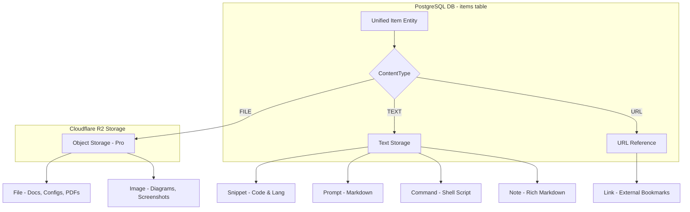

# DevStash Item Types — Technical Documentation

> **DevStash** provides a developer-native knowledge hub designed around 7 core system item types. This document details each type's specification, database schema mapping, visual identity, storage classification, and UI rendering behaviors.

---

## 1. Overview & System Types Reference

DevStash models all developer assets through a single unified `Item` entity linked to an `ItemType`. The system ships with seven pre-configured system item types (`isSystem: true`), classified into three underlying storage patterns: **Text**, **File**, and **URL**.

### System Types Specification Table

| Order | System Name | Display Name | Storage Class (`ContentType`) | Lucide Icon | Hex Accent Color | Free / Pro | Purpose & Developer Scenario |
|:---:|:---|:---|:---:|:---|:---:|:---:|:---|
| 1 | `snippet` | **Snippets** | `TEXT` | `Code` | `#3b82f6` (Blue) | Free | Reusable code blocks with syntax highlighting and language definition |
| 2 | `prompt` | **Prompts** | `TEXT` | `Sparkles` | `#8b5cf6` (Purple) | Free | AI system prompts, persona templates, and LLM workflow instructions |
| 3 | `command` | **Commands** | `TEXT` | `Terminal` | `#f97316` (Orange) | Free | CLI one-liners, terminal scripts, deployment and shell pipelines |
| 4 | `note` | **Notes** | `TEXT` | `StickyNote` | `#fde047` (Yellow) | Free | Markdown documentation, scratchpads, architectural notes, checklists |
| 5 | `file` | **Files** | `FILE` | `File` | `#6b7280` (Gray) | **Pro** | Binary documents, configuration files, `.env` templates, PDFs in R2 |
| 6 | `image` | **Images** | `FILE` | `Image` | `#ec4899` (Pink) | **Pro** | Architecture diagrams, UI screenshots, visual references in R2 |
| 7 | `link` | **Links** | `URL` | `Link` | `#10b981` (Green) | Free | Bookmarks, API specs, pull request references, web documentation |

---

## 2. Deep Dive: The 7 System Item Types

### 1. Snippet (`snippet`)
- **System Identifier:** `snippet`
- **Display Name:** `Snippets` (Sidebar & Headers), `Snippet` (Card / Drawer)
- **Lucide Icon:** `Code`
- **Hex Color Accent:** `#3b82f6` (Tailwind blue-500)
- **Storage Class:** `ContentType.TEXT`
- **Primary Purpose:** Storing code snippets across multiple programming languages (TypeScript, Python, Go, Rust, SQL, Dockerfile, etc.) for quick reference and copying into active projects.
- **Key Database Fields:**
  - `content`: Holds the raw code block as text (`@db.Text`).
  - `language`: Required programming language identifier (e.g., `"typescript"`, `"python"`, `"dockerfile"`, `"sql"`). Used by syntax highlighters.
  - `description`: Contextual explanation of the code snippet's purpose and usage.
  - *Unused / Null Fields:* `url`, `fileUrl`, `fileName`, `fileSize`, `mimeType`, `storageKey`.
- **Primary Interactions:** One-click copy to clipboard, syntax-highlighted code viewer with line numbers, language filter.

### 2. Prompt (`prompt`)
- **System Identifier:** `prompt`
- **Display Name:** `Prompts` (Sidebar & Headers), `Prompt` (Card / Drawer)
- **Lucide Icon:** `Sparkles`
- **Hex Color Accent:** `#8b5cf6` (Tailwind purple-500)
- **Storage Class:** `ContentType.TEXT`
- **Primary Purpose:** Curating AI engineering prompts, LLM personas, refactoring directives, code review rubrics, and automated agent prompts.
- **Key Database Fields:**
  - `content`: Complete prompt template text, markdown formatted, often containing template variables (e.g., `{{diff}}`, `{{input}}`).
  - `language`: Defaults to `"markdown"` or `"text"`.
  - `description`: Target persona or prompt objective (e.g., "Senior security auditor persona to inspect pull requests").
  - *Unused / Null Fields:* `url`, `fileUrl`, `fileName`, `fileSize`, `mimeType`, `storageKey`.
- **Primary Interactions:** "Copy Prompt" action, variable placeholder highlighting, markdown rendering.

### 3. Command (`command`)
- **System Identifier:** `command`
- **Display Name:** `Commands` (Sidebar & Headers), `Command` (Card / Drawer)
- **Lucide Icon:** `Terminal`
- **Hex Color Accent:** `#f97316` (Tailwind orange-500)
- **Storage Class:** `ContentType.TEXT`
- **Primary Purpose:** Shell one-liners, terminal recipes, Git operations, Docker container lifecycle commands, and CI/CD shell snippets.
- **Key Database Fields:**
  - `content`: Shell command or script body (`@db.Text`).
  - `language`: Usually `"bash"`, `"zsh"`, `"sh"`, or `"powershell"`.
  - `description`: Concise explanation of what the command does, flags used, and expected side effects.
  - *Unused / Null Fields:* `url`, `fileUrl`, `fileName`, `fileSize`, `mimeType`, `storageKey`.
- **Primary Interactions:** Quick copy button formatted for instant paste into a terminal emulator, single-line monospace display badge.

### 4. Note (`note`)
- **System Identifier:** `note`
- **Display Name:** `Notes` (Sidebar & Headers), `Note` (Card / Drawer)
- **Lucide Icon:** `StickyNote`
- **Hex Color Accent:** `#fde047` (Tailwind yellow-300 / amber-400)
- **Storage Class:** `ContentType.TEXT`
- **Primary Purpose:** Markdown documentation, architectural decision records (ADRs), meeting summaries, checklist notes, and project scratchpads.
- **Key Database Fields:**
  - `content`: Markdown text supporting headers, lists, code spans, and blockquotes (`@db.Text`).
  - `language`: Defaults to `"markdown"`.
  - `description`: Summary of the document topic or scope.
  - *Unused / Null Fields:* `url`, `fileUrl`, `fileName`, `fileSize`, `mimeType`, `storageKey`.
- **Primary Interactions:** Rendered markdown document reader, expandable headings, reading time indicator.

### 5. File (`file`)
- **System Identifier:** `file`
- **Display Name:** `Files` (Sidebar & Headers), `File` (Card / Drawer)
- **Lucide Icon:** `File`
- **Hex Color Accent:** `#6b7280` (Tailwind gray-500)
- **Storage Class:** `ContentType.FILE`
- **Entitlement:** **Pro Tier** required for uploads.
- **Primary Purpose:** Archiving non-image project assets, configuration templates (`.env.production`), certificate bundles, PDF guides, and structured specs.
- **Key Database Fields:**
  - `fileUrl`: Public or signed CDN download URL (backed by Cloudflare R2).
  - `fileName`: Original uploaded filename (e.g., `production.env.template`, `architecture-spec.pdf`).
  - `fileSize`: Size in bytes (`BigInt` in Prisma schema).
  - `mimeType`: Detected media type (e.g., `text/plain`, `application/pdf`, `application/json`).
  - `storageKey`: Cloudflare R2 bucket object path / UUID key.
  - `content`: Optional inline fallback or text extraction; null for raw binary assets.
  - `description`: Notes explaining the file contents, source, or purpose.
  - *Unused / Null Fields:* `url` (external bookmark URL).
- **Primary Interactions:** Download button, file size badge, MIME type badge, file extension chip.

### 6. Image (`image`)
- **System Identifier:** `image`
- **Display Name:** `Images` (Sidebar & Headers), `Image` (Card / Drawer)
- **Lucide Icon:** `Image`
- **Hex Color Accent:** `#ec4899` (Tailwind pink-500)
- **Storage Class:** `ContentType.FILE`
- **Entitlement:** **Pro Tier** required for uploads.
- **Primary Purpose:** Visual assets such as cloud architecture diagrams, UI mockups, database ERDs, bug screenshots, and design references.
- **Key Database Fields:**
  - `fileUrl`: Public or presigned CDN URL to high-resolution asset in Cloudflare R2.
  - `fileName`: Image filename (e.g., `aws-vpc-architecture.png`).
  - `fileSize`: Byte size (`BigInt`).
  - `mimeType`: Image MIME type (e.g., `image/png`, `image/jpeg`, `image/webp`, `image/svg+xml`).
  - `storageKey`: R2 storage object key.
  - `description`: Image context, caption, or architectural annotations.
  - *Unused / Null Fields:* `language`.
- **Primary Interactions:** Inline image thumbnail, modal lightbox / full-size viewer, aspect ratio preservation, direct image download.

### 7. Link (`link`)
- **System Identifier:** `link`
- **Display Name:** `Links` (Sidebar & Headers), `Link` (Card / Drawer)
- **Lucide Icon:** `Link`
- **Hex Color Accent:** `#10b981` (Tailwind emerald-500)
- **Storage Class:** `ContentType.URL`
- **Primary Purpose:** Developer bookmarks, documentation URLs, GitHub repository references, RFC links, and SaaS console shortcuts.
- **Key Database Fields:**
  - `url`: The destination web address (e.g., `https://tailwindcss.com/docs`, `https://neon.tech/docs`).
  - `content`: Optional summary, extract, or mirror of the target link URL.
  - `description`: Explains what the destination resource is and why it was bookmarked.
  - `language`: Stored as `"url"` in seed/UI helpers.
  - *Unused / Null Fields:* `fileUrl`, `fileName`, `fileSize`, `mimeType`, `storageKey`.
- **Primary Interactions:** Clickable external link (opening in new tab with `rel="noopener noreferrer"`), domain badge extractor (e.g., `neon.tech`), copy URL button.

---

## 3. Storage Classification: Text vs File vs URL

DevStash leverages a single unified table (`items`) with an explicit `ContentType` enum in Postgres to balance database simplicity with multi-format flexibility.



### Classification Comparison Matrix

| Storage Category | Enum Value | Associated Types | Data Storage Target | Key Model Attributes | Size Limits & Tier Constraints |
|:---|:---:|:---|:---|:---|:---|
| **Text** | `ContentType.TEXT` | `snippet`, `prompt`, `command`, `note` | PostgreSQL `content` text column | `content`, `language` | Standard Postgres text capacity. Available on Free & Pro tiers. |
| **File** | `ContentType.FILE` | `file`, `image` | Cloudflare R2 (S3-compatible object store) + DB metadata | `fileUrl`, `fileName`, `fileSize`, `mimeType`, `storageKey` | Up to R2 file limit. **Pro tier only** (`isPro: true`). Uploads disabled on Free tier. |
| **URL** | `ContentType.URL` | `link` | PostgreSQL `url` varchar column | `url`, `content` (optional notes) | Web URLs (`http://`, `https://`). Available on Free & Pro tiers. |

### Architectural Rationale
1. **Zero Egress Object Storage (Cloudflare R2):** Heavy binary files and images are never stored directly in PostgreSQL bytea columns. The database only tracks metadata pointers (`storageKey`, `fileUrl`, `mimeType`, `fileSize`), preserving database performance and fast backups.
2. **First-Class Text Search:** Because `snippet`, `prompt`, `command`, and `note` content resides in PostgreSQL's native text columns, full-text search (`tsvector` / PostgreSQL trigram indexes) operates across all text items without third-party search engines.
3. **Graceful Degradation:** A single relational table avoids separate tables for every item type, making queries, pagination, collections, and tagging uniform across all items.

---

## 4. Shared Properties & Entity Relationships

Every item in DevStash inherits a universal set of core attributes and relational capabilities, regardless of its item type.

### 1. Shared Database Attributes (`Item` Model)
- **Primary Key:** `id` (`String @id @default(cuid())`)
- **Descriptive Header:**
  - `title`: Primary item title (e.g., `"useDebounce Hook"`).
  - `description`: Short textual summary shown on item cards and in drawers.
- **Status Flags:**
  - `isFavorite` (`Boolean @default(false)`): Starred item indicator; controls presence in favorites filter.
  - `isPinned` (`Boolean @default(false)`): Quick-access dashboard pin; controls visibility in the "Pinned" dashboard grid.
- **Tenancy & Ownership:**
  - `userId`: Foreign key to `User`. All queries and mutations are strictly scoped by this `userId`.
  - Cascades on User deletion (`onDelete: Cascade`).
- **Type Association:**
  - `itemTypeId`: Foreign key to `ItemType`. Restricts deletion if items are bound (`onDelete: Restrict`).
- **Audit Timestamps:**
  - `createdAt` (`DateTime @default(now())`)
  - `updatedAt` (`DateTime @updatedAt`)

### 2. Multi-Collection Membership (Many-to-Many)
Items do not live in a single hierarchical directory. Via the `ItemCollection` join model (`[itemId, collectionId]` composite primary key), an item can belong to multiple collections simultaneously (e.g., a custom hook can belong to both "React Patterns" and "Interview Prep").

```prisma
model ItemCollection {
  itemId       String
  collectionId String
  addedAt      DateTime   @default(now())

  item         Item       @relation(fields: [itemId], references: [id], onDelete: Cascade)
  collection   Collection @relation(fields: [collectionId], references: [id], onDelete: Cascade)

  @@id([itemId, collectionId])
  @@index([collectionId, addedAt])
  @@map("item_collections")
}
```

### 3. User-Scoped Tagging (Many-to-Many)
Tags cross-cut across all item types and collections. Through `ItemTag` and `Tag` (`@@unique([userId, name])`), users can tag items freely without collisions with other tenants.

```prisma
model ItemTag {
  itemId String
  tagId  String

  item   Item @relation(fields: [itemId], references: [id], onDelete: Cascade)
  tag    Tag  @relation(fields: [tagId], references: [id], onDelete: Cascade)

  @@id([itemId, tagId])
  @@index([tagId])
  @@map("item_tags")
}
```

---

## 5. UI Display & Interaction Differences

DevStash presents items differently depending on context and type, emphasizing developer speed and readability.

### 1. Dashboard Item Card (`ItemCard`)
Rendered in `src/components/dashboard/item-card.tsx`:
- **Accent Border:** A 3px left border styled dynamically using `item.typeColor` (e.g., `#3b82f6` for Snippet, `#f97316` for Command).
- **Square Type Icon:** Rounded icon container with translucent background `bg-muted/40` and Lucide icon in the item type's accent color.
- **Metadata Badges:**
  - Pinned pin icon (`Pin` rotated 45°) if `isPinned === true`.
  - Filled amber star (`Star` in `text-amber-400`) if `isFavorite === true`.
  - Formatted relative/short creation date (e.g., `"Jan 15"`).
- **Tags Row:** Rendered as compact badges (`bg-muted/40 border border-border/60 text-[11px]`).

### 2. Sidebar Navigation (`SidebarNavTypes`)
Rendered in `src/components/layout/sidebar-nav-types.tsx`:
- **Deterministic Sort Order:** System types follow `SYSTEM_ORDER`:
  1. `snippet` → 2. `prompt` → 3. `command` → 4. `note` → 5. `file` → 6. `image` → 7. `link`.
- **Live Counter Badges:** Each row displays a real-time aggregate count computed via `prisma.item.groupBy` scoped to the current user.
- **Pro Badge Pill:** Files and Images feature a distinct uppercase `PRO` badge (`text-[9px] font-semibold`) alerting free users of upgraded capabilities.
- **Routing:** Navigates directly to `/items/[type]` (e.g., `/items/snippet`, `/items/prompt`).

### 3. Slide-over Detail Drawer & Type-Specific Viewers
When an item is clicked, the detail drawer renders type-tailored viewer surfaces:

| Item Type | Primary Viewer Component | Type-Specific UI Controls |
|:---|:---|:---|
| **Snippet** | Syntax-highlighted code block with line numbers | Language chip, "Copy Code" button, full-screen toggle |
| **Prompt** | Markdown prompt reader with parameter highlight | "Copy Prompt" button, template variables chips |
| **Command** | Terminal shell box with dark monospace font | "Copy Command" button, single-click copy |
| **Note** | Rich Markdown document preview | Table of contents, header anchors, reading time |
| **File** | File download card with metadata breakdown | Direct download button, file size, MIME type indicator |
| **Image** | Image lightbox preview container | Image zoom / modal preview, download button, dimension tags |
| **Link** | External link card with preview & domain extractor | "Visit Link" button (new tab), "Copy URL" button |

---

## 6. Codebase File Map & Reference Implementations

| Subsystem | File Path | Key Responsibilities |
|:---|:---|:---|
| **Database Schema** | [`prisma/schema.prisma`](file:///workspaces/devstash/prisma/schema.prisma#L9-L149) | Defines `enum ContentType`, `model ItemType`, and `model Item` with relational constraints. |
| **Database Seed** | [`prisma/seed.ts`](file:///workspaces/devstash/prisma/seed.ts#L9-L17) | Seeds `SYSTEM_ITEM_TYPES`, demo user, sample collections, and 18 real-world items. |
| **Server Data Access** | [`src/lib/db/items.ts`](file:///workspaces/devstash/src/lib/db/items.ts#L178-L265) | `getSidebarItemTypes`, `getPinnedItems`, `getRecentItems`, `getItemStats`, `SYSTEM_ORDER`, `DISPLAY_NAMES`. |
| **UI Type Navigation** | [`src/components/layout/sidebar-nav-types.tsx`](file:///workspaces/devstash/src/components/layout/sidebar-nav-types.tsx#L21-L37) | `ICON_MAP`, collapsible Types navigation, Lucide icons, `PRO` badges. |
| **Card Presentation** | [`src/components/dashboard/item-card.tsx`](file:///workspaces/devstash/src/components/dashboard/item-card.tsx#L16-L56) | Reusable item card with left border color, type icon badge, favorite & pin indicators. |
| **Type Route View** | [`src/app/(app)/items/[type]/page.tsx`](file:///workspaces/devstash/src/app/(app)/items/[type]/page.tsx#L1-L70) | Dedicated view for filtering items by specific item type with breadcrumb header. |
| **Mock Fallback Data** | [`src/lib/mock-data.ts`](file:///workspaces/devstash/src/lib/mock-data.ts#L11-L19) | Initial client mock item type list and item schemas. |
| **Project Overview** | [`context/project-overview.md`](file:///workspaces/devstash/context/project-overview.md#L46-L67) | High-level architecture, plan entitlements, and system specification. |
